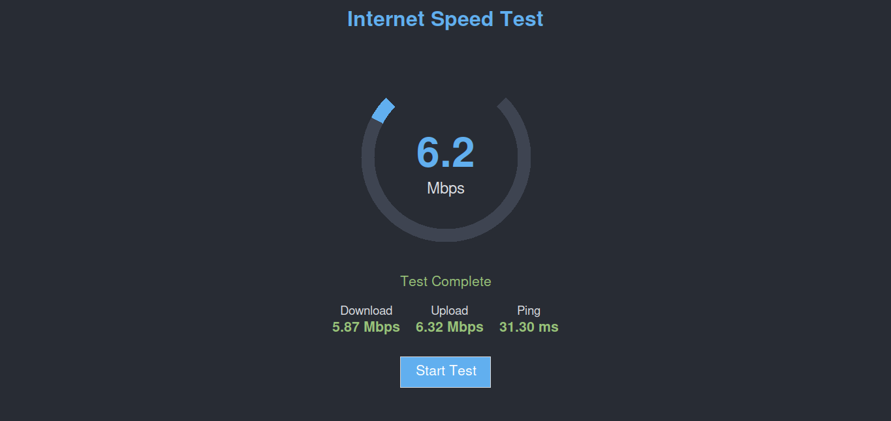

# PingSprint

Ping Sprint is a fun application built using Python and Tkinter to test your internet speed. It measures download speed, upload speed, and ping.

## Features

- Display of download speed, upload speed, and ping

## Screenshots



## Prerequisites

- Python 3.x
- `speedtest-cli` library

## Installing Dependencies

First, ensure you have the required libraries. You can install them using pip3:

```sh
pip3 install speedtest-cli
```

## Running the Application

Save the code in a file named `internet_speedtest.py` (or whichever name you choose) and run the script using Python:

```sh
python3 internet_speedtest.py
```

Make the script executable:

```sh
chmod +x internet_speedtest.py
```

Run the script using:

```sh
./internet_speedtest
```
